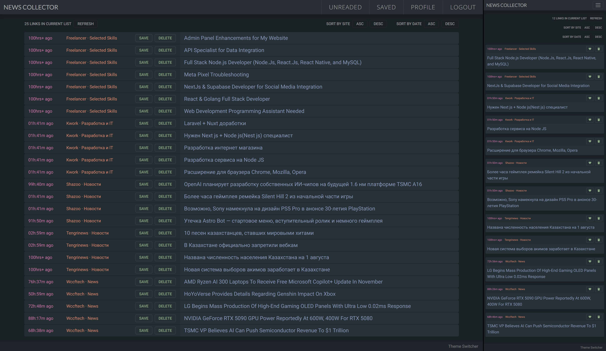

News Collector (Frontend/Backend Code)
==========================
Персональный проект которым я пользуюсь для чтения новостей.

## Использованные технологии
- Языки: JavaScript/TypeScript
- Фреймворк: Next.js 
- Фронт: React, TailwindCSS, Redux Toolkit, RTK Query
- Бэк: REST API, JWT, PostgreSQL

Выложено для портфолио.

#

